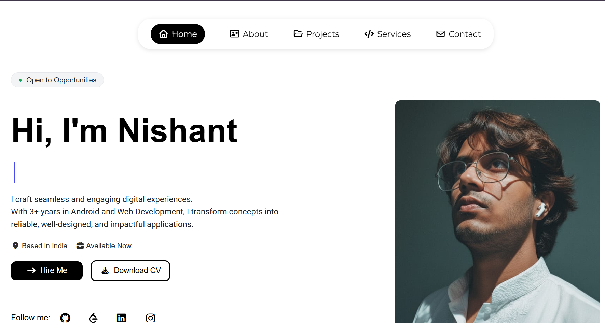

# Nishant Kumar - Portfolio Website

A modern, fully responsive personal portfolio website for **Nishant Kumar**, an Android & Web Developer. It showcases skills, featured projects, services, and contact information with a clean dark theme, smooth scroll reveals, a typing role animation, and a cinematic "falling into place" preloader intro.



## Live Sections

| Section | Heading | Description |
| --- | --- | --- |
| Home | Hi, I'm Nishant | Intro, rotating role titles, location/availability, Hire Me, Download CV, and social links |
| About | Creating Smart Digital Solutions | Background, what drives me, languages, education, and project count |
| Projects | Featured Work | Nine featured projects with images, descriptions, tech tags, and GitHub links |
| Services | What I Do | Android, Web, AI/ML, Data Science, Data Analysis, and Database & Backend |
| Contact | Get in Touch with Us | Contact details and a working Formspree contact form |

## Features

- Cinematic preloader intro where the laptop icon, "MY PROFILE" title, tech icons, and credit line fall into place in sequence
- Animated typing effect that cycles through developer roles
- Smooth-scroll navigation with active-link highlighting and a mobile hamburger menu
- Scroll-reveal animations on every section using `IntersectionObserver`
- Responsive layout for desktop, tablet, and mobile
- Back-to-top button
- Contact form with AJAX submission and success/error feedback
- Respects `prefers-reduced-motion` for users who disable animations (the intro still plays)

## Tech Stack

- **HTML5**
- **CSS3** - Flexbox, Grid, media queries, keyframe animations, custom scrollbars
- **JavaScript (Vanilla)** - DOM, timers, `IntersectionObserver`, `fetch`
- **Font Awesome 7** - Icons
- **Google Fonts** - Montserrat, Open Sans, Playfair Display, Unbounded
- **Formspree** - Contact form backend

## Folder Structure

```
My-portfolio-site-2/
├── index.html          # Page markup and preloader
├── stayle.css          # All styling, animations, and responsive rules
├── main.js             # Navigation, typing animation, preloader, form, reveals
├── README.md
└── images/
    ├── nishant.jpg                  # Hero profile photo
    ├── img2.jpg                     # About section photo
    ├── favicon-icon.png             # Favicon
    ├── Nishant_Kumar_Resume.pdf     # Downloadable CV
    ├── leetcode icon.webp           # LeetCode social icon
    ├── portfollio.png               # Portfolio project thumbnail
    ├── jobease.jpg                  # JobEase project thumbnail
    ├── to-do.jpg                    # To-Do List App thumbnail
    ├── wallpaper.jpg                # Wallpaper App thumbnail
    ├── sos.jpg                      # SOS Emergency App thumbnail
    ├── chat-app.jpg                 # Real-Time Chat App thumbnail
    ├── nyaya_ai.png                 # NyayaAI project thumbnail
    ├── telegram_bot.png             # NIFTY Trading Bot thumbnail
    ├── diabetes_ann.png             # Diabetes Prediction ANN thumbnail
    ├── app.svg                      # Android Development service icon
    ├── web.svg                      # Web Development service icon
    ├── ai.png                       # AI & Machine Learning service icon
    └── database.png                 # Database & Backend service icon
```

## Featured Projects

| Project | Description | Tech |
| --- | --- | --- |
| [JobEase](https://github.com/kazuaki83358/Automated-Job-Finder.git) | Flask-based automated job aggregator that scrapes Indeed and Naukri, stores data in SQLite, updates daily, and emails new openings. | Python, Flask, BeautifulSoup, Selenium, SQLite |
| [Portfolio Website](https://github.com/kazuaki83358/My-portfolio-site.git) | Responsive personal portfolio with smooth animations and a consistent theme. | HTML, CSS, JavaScript |
| [To-Do List App](https://github.com/kazuaki83358/Android-Project-Using-Jetpack-Compose/tree/main/TodoApp) | Android task manager with a clean, modern UI. | Kotlin, Jetpack Compose, Room |
| [Wallpaper App](https://github.com/kazuaki83358/Android-Project-Using-Jetpack-Compose/tree/main/AnimeWallpaperApp) | Fetches high-quality wallpapers by API with download and set support. | Kotlin, Retrofit, Jetpack Compose |
| [SOS Emergency App](https://github.com/kazuaki83358/Android-Project-Using-Jetpack-Compose/tree/main/Emergencyassistance) | Sends your live location via SMS to saved contacts, with voice commands and a one-tap trigger. | Kotlin, Room, Location API |
| [Real-Time Chat App](https://github.com/kazuaki83358/web-socket-chat-app.git) | Android chat app connected to a Ktor backend for real-time messaging. | Kotlin, Jetpack Compose, Ktor, Sockets |
| [NyayaAI](https://github.com/kazuaki83358/NyayaAI_App.git) | AI-powered legal assistance app with legal guidance, lawyer consultations, and real-time chat. | Kotlin, Jetpack Compose, Firebase, Flask, Retrofit |
| [NIFTY Trading Bot](https://github.com/kazuaki83358/Nifty-bot.git) | Telegram bot for NIFTY 50 analysis with technical indicators and ML predictions. | Python, Telegram Bot, Scikit-learn, Pandas |
| [Diabetes Prediction ANN](https://github.com/kazuaki83358/Diabetes-Risk-Assessment-System-ANN.git) | ANN-based diabetes risk assessment web app. | Python, TensorFlow, Keras, Streamlit |

## Getting Started

No build step is required. This is a static site.

1. Clone the repository:

   ```bash
   git clone https://github.com/kazuaki83358/My-portfolio-site.git
   ```

2. Open `index.html` directly in a browser, or serve it locally:

   ```bash
   # Python 3
   python -m http.server 5500
   ```

   Then visit `http://localhost:5500`.

> Tip: Hard-refresh (`Ctrl + Shift + R`) after editing `stayle.css` or `main.js` to bypass the browser cache.

## Contact

- **Email:** nishant.kumar83358@gmail.com
- **Phone:** +91-8851807684
- **Location:** Delhi, India
- **GitHub:** https://github.com/kazuaki83358
- **LinkedIn:** https://www.linkedin.com/in/nishant-kumar-958b36281
- **Instagram:** https://www.instagram.com/nishantrajput_83

## License

Copyright (c) 2025 kazuaki. All rights reserved.
